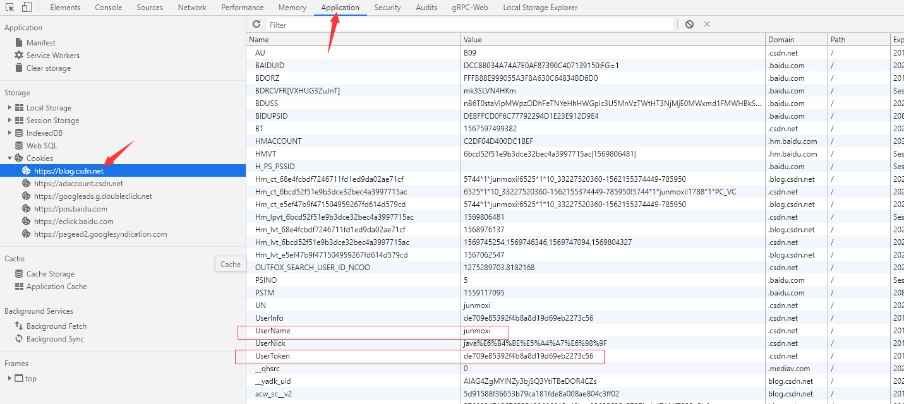

# 批量导出CSDN博客
> 批量导出`csnd`博客，并转化为`hexo`博客样式，只能导出`markdown`编写的博客

# Quick start
```bash
go run main.go -username 你的csdn用户名 -cookie 你csdn的cookie -page 1
```
> page不写，默认为下载全部页

# Demo

```bash
go run main.go -username "junmoxi" -cookie "UserName=junmoxi; UserToken=c3c29cca48be43c4884fe36d052d5851"
```
> 如果想下载别人的文章，那么将`username`更换为别人的即可，cookie还是用你的

# cookie获取


# 关注
> 如果对你有所帮助，请给个star，你的支持是我最大的动力，欢迎关注我微信公众号，一起学习Go语言

